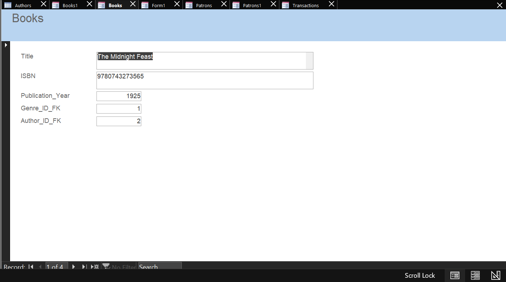
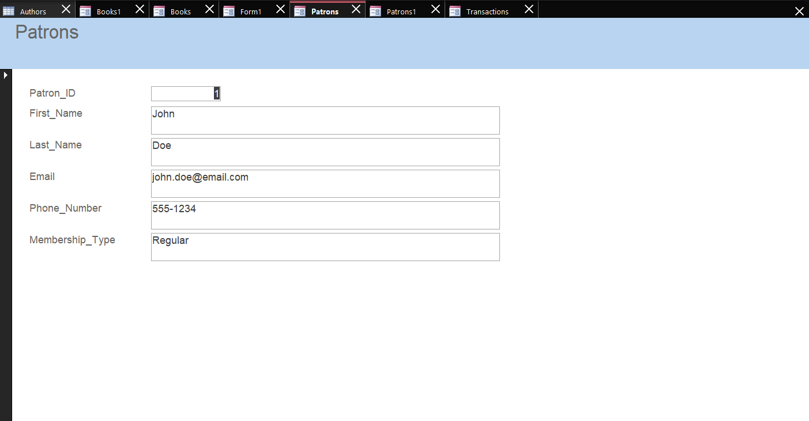

#  Library Management System – Microsoft Access Database  

##  Project Overview  
This project is a fully functional **Library Management System** built using **Microsoft Access** to manage book inventory, patrons, transactions, and reporting. It was designed to simulate how real libraries track checkouts, returns, member activity, and overdue items.

The system supports **data entry, automation, reporting, and relational integrity**, making it a strong example of applied database design for business and administrative environments.

---

##  Tools & Technologies Used  
- Microsoft Access  
- Relational Database Design  
- SQL Queries  
- Forms & Subforms  
- Macros (AutoExec, Navigation)  
- Reports & Business Logic  

---

## Database Structure  
The system consists of **7 normalized relational tables**, including:

- **Books** – Stores book details and availability  
- **Patrons** – Tracks library members  
- **Transactions** – Records checkouts and returns  
- **Book_Copies** – Manages multiple copies per title  
- **Authors** – Author reference table  
- **Genres** – Genre classification  
- **Overdue_Reports** – Tracks overdue status for reporting  

Referential integrity is enforced using primary and foreign keys to maintain data accuracy.

---

## Key Features  

Relational database with enforced relationships  
User-friendly **data entry forms** for:  
- Book Entry  
- Member Registration  
- Book Checkout  
- Book Return  

**Patron Details subform** for viewing member activity  
Automated **Main Menu navigation using macros**  
Pre-built **reports for management**, including:  
- Book Availability Report  
- Overdue Books Report  
- Member Checkout History Report  

---

## Business Value  
This system improves:
- Inventory tracking  
- Member accountability  
- Overdue monitoring  
- Daily library operations  
- Reporting efficiency for staff  

It demonstrates how databases support **real-world operational decision-making**.

---

## Project Screenshots  
### 📘 Book Entry Form

### 👤 Member Registration Form

- Table Relationships Diagram  
- Book Entry Form  
- Member Registration Form  
- Checkout & Return Forms  
- Main Menu Navigation  
- Overdue Books Report  

---

## Files Included  
- `Library_Management_System.accdb` – Main Access Database  
- `tables/` – Table design screenshots  
- `forms/` – Form and subform images  
- `reports/` – Output report images  
- `relationships.png` – Entity Relationship Diagram  

---

## Skills Demonstrated  
- Relational Database Design  
- Business Process Automation  
- Data Integrity Enforcement  
- Form-Based Data Entry  
- Analytical Reporting  
- User Interface Design for Databases  

---

## Summary  
This project represents a complete **end-to-end database solution** for library operations and reflects hands-on experience with **database systems, automation, and reporting** in a business setting.
Add Library Management System project
Embed Book Entry Form screenshot
Add Member Registration Form screenshot

